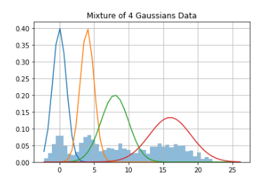

# mixtures


## Examples

Define a mixture model and generate sample data according to the model. We can then fit a mixture model to the data and compare our fitted model to actuals.

```python
gmm = mixtures.FiniteGMM(k = 4, mu = [0,4,8,16], sigma = [1,1,2,3], phi = [.2,.2,.2,.4])
gmm.data_gen(1000)
gmm.plot_data(alpha = .5, bins = 50)
```

<p align="center">
  
</p>

```python
gmm.gibbs(iters=500)
gmm.plot_results(alpha = .5)
```