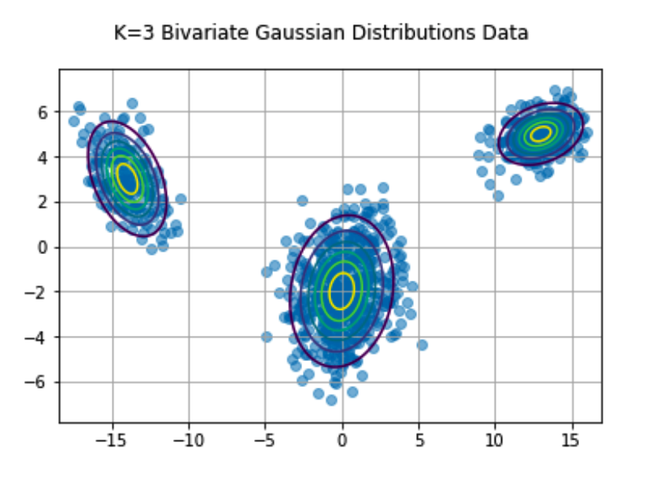

# mixtures


# Examples

Define a mixture model and generate sample data according to the model. We can then fit a mixture model to the data and compare our fitted model to actuals.

```python
import mixtures
import numpy as np

gmm = mixtures.FiniteGMM(k = 4, mu = [0,4,8,16], sigma = [1,1,2,3], phi = [.2,.2,.2,.4])
gmm.data_gen(1000)
gmm.plot_data(alpha = .5, bins = 50)
```

<p align="center">
  
</p>

```python
gmm.gibbs(iters=500)
gmm.plot_results(alpha = .5)
```

We can also generate and fit multitvariate data by simply providing multivariate parameters to the model. The ```FiniteGMM``` class will detect the shape of the inputs and set ```self.multivariate = True```. This tells the class to take different actions on the inputs and uses a collapsed gibbs sampler for fitting the model.

```python
# Define parameters for K=3 Mixture of Multivariate Gaussians

phi = [.3, .5, .2]
mu = np.array([[13,5], [0,-2], [-14,3]])
cov_1 = np.array([[2.0, 0.3], [0.3, 0.5]])
cov_2 = np.array([[3.0,.4], [.4,3.0]])    
cov_3 = np.array([[1.7,-.7], [-.7,1.7]])
cov = np.stack((cov_1, cov_2, cov_3), axis = 0)

gmm = mixtures.FiniteGMM(3, mu, cov, phi)
```

Now we can use the same functionality as in the univariate case.

```python
gmm.data_gen(1000)
gmm.plot_data(alpha = .5)
```

<p align="center">
  
</p>